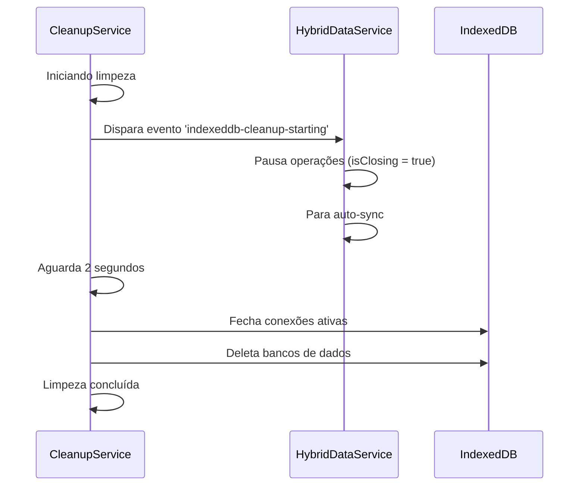

# 🔧 Correção dos Erros InvalidStateError no IndexedDB

## 📋 Problemas Identificados

1. **Página inicial incorreta**: A aplicação estava iniciando na página `cleanup-test` em vez de `home`
2. **Conflitos de sincronização**: O HybridDataService tentava fazer operações no IndexedDB enquanto o sistema de limpeza estava fechando as conexões
3. **Verificação de conexão insuficiente**: O método `isDBConnectionActive()` não era robusto o suficiente
4. **Tratamento de erro limitado**: Apenas `InvalidStateError` era tratado corretamente

## ✅ Correções Implementadas

### 1. Página Inicial Corrigida
```typescript
// AppContext.tsx - linha 146
const [currentPage, setCurrentPage] = useState<PageType>('home'); // era 'cleanup-test'
```

### 2. Verificação de Conexão Melhorada
```typescript
// hybridDataService.ts - método isDBConnectionActive()
private isDBConnectionActive(): boolean {
  if (!this.db || this.isDestroying || this.isClosing) return false;
  
  try {
    // Verificação mais robusta
    if (this.db.objectStoreNames.length === 0) return false;
    
    // Verificar se existe a store necessária
    if (!this.db.objectStoreNames.contains('projects_cache')) {
      console.warn('⚠️ Store projects_cache não encontrada');
      return false;
    }
    
    // Testar criação de transação
    const testTransaction = this.db.transaction(['projects_cache'], 'readonly');
    
    if (!testTransaction || testTransaction.error) {
      return false;
    }
    
    return true;
  } catch (transactionError) {
    console.warn('⚠️ Erro ao criar transação de teste:', transactionError.name);
    return false;
  }
}
```

### 3. Tratamento de Erros Expandido
```typescript
// hybridDataService.ts - método executeWithRetry()
if (error.name === 'InvalidStateError' || 
    error.name === 'TransactionInactiveError' ||
    error.message.includes('connection is closing') ||
    error.message.includes('database connection is closing') ||
    error.message.includes('transaction is not active')) {
  console.warn('❌ Conexão IndexedDB foi fechada ou inativa, cancelando operação:', error.name);
  // Marcar conexão como inativa
  this.db = null;
  throw error;
}
```

### 4. Sistema de Coordenação Melhorado
```typescript
// cleanupService.ts - método cleanIndexedDB()
// Avisar sobre limpeza e aguardar sincronizações finalizarem
console.log('📢 Notificando componentes sobre limpeza iminente...');
window.dispatchEvent(new CustomEvent('indexeddb-cleanup-starting'));

// Aguardar tempo para sincronizações em andamento finalizarem
await new Promise(resolve => setTimeout(resolve, 2000));
```

```typescript
// hybridDataService.ts - listener de evento
window.addEventListener('indexeddb-cleanup-starting', () => {
  console.log('📢 Limpeza do IndexedDB será iniciada - pausando operações...');
  this.isClosing = true;
  
  // Parar auto-sync imediatamente
  if (this.syncTimer) {
    clearInterval(this.syncTimer);
    this.syncTimer = null;
  }
});
```

### 5. Método Destroy Mais Seguro
```typescript
// hybridDataService.ts - método destroy()
destroy(): void {
  console.log('🔄 Destruindo HybridDataService...');
  
  // Marcar como sendo destruído para parar todas as operações
  this.isDestroying = true;
  this.isClosing = true;
  
  // Parar sync imediatamente
  if (this.syncTimer) {
    clearInterval(this.syncTimer);
    this.syncTimer = null;
  }
  
  // Limpar event listeners primeiro
  this.eventListeners.clear();
  
  // Aguardar operações finalizarem antes de fechar
  setTimeout(() => {
    if (this.db) {
      try {
        // Verificar se ainda está aberta antes de fechar
        if (this.db && !this.db.objectStoreNames) {
          console.log('⚠️ Conexão IndexedDB já foi fechada');
        } else {
          this.db.close();
          console.log('✅ Conexão IndexedDB fechada durante destruição');
        }
      } catch (error) {
        console.warn('⚠️ Erro ao fechar IndexedDB durante destruição:', error);
      } finally {
        this.db = null;
      }
    }
  }, 300);
}
```

### 6. Componente de Monitoramento
Criado `SystemHealthCheck.tsx` para monitorar a saúde do sistema:
- Verifica status do HybridDataService
- Testa conexões IndexedDB
- Monitora sincronização
- Exibe alertas em tempo real

## 🎯 Resultados Esperados

1. **Eliminação do InvalidStateError**: Sistema coordena melhor as operações para evitar conflitos
2. **Inicialização correta**: Aplicação agora inicia na página home
3. **Monitoramento em tempo real**: Componente de verificação de saúde mostra status dos sistemas
4. **Recuperação automática**: Sistema detecta e se reconecta automaticamente quando necessário
5. **Limpeza segura**: Processo de limpeza agora avisa outros componentes antes de proceder

## 🔄 Processo de Coordenação



## 🧪 Como Testar

1. Acesse a aplicação - deve iniciar na página home
2. Observe o componente "Status do Sistema" na página inicial
3. Todos os indicadores devem estar verdes (Saudável)
4. Se necessário, acesse `/cleanup-test` para executar limpeza controlada
5. Verifique os logs do console para confirmação das correções

## 📝 Notas Importantes

- As correções mantêm o design glassmorphism original
- Sistema híbrido continua funcionando offline
- Limpeza de dados continua disponível para desenvolvimento
- Monitoramento em tempo real ajuda a detectar problemas rapidamente
- Logs detalhados facilitam debugging futuro